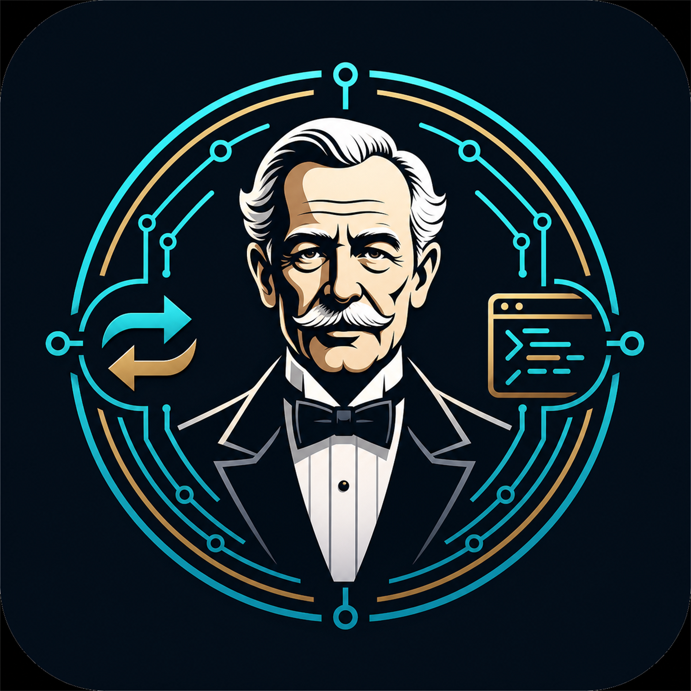

<p align="center">
  
</p>

<h1 align="center">Alfred</h1>

<p align="center">
  A CLion dev environment butler for embedded and multi-chip projects.
</p>

<p align="center">
  <a href="https://github.com/linkyourbin/Alfred/actions/workflows/release.yml">
    
  </a>
</p>

Alfred saves your current CLion project setup and IDE settings into named
profiles, then lets you switch between them when you move between chips,
toolchains, SDKs, debuggers, or board configurations.

## Why Alfred

CLion has excellent toolchain, CMake, debugger, and embedded development
settings, but real embedded work often needs several complete environments in
the same project. One chip may use OpenOCD and an ARM GCC toolchain, another may
use a vendor SDK, another may use a different CMake preset and debugger setup.

Alfred treats each setup as a named profile. Configure CLion once for a target,
save it, and switch back to it later without manually rebuilding the setup from
memory.

## Platform Support

Alfred is a platform-independent CLion plugin. The same `alfred.zip` release
artifact can be installed on CLion for Windows, macOS, and Linux.

Profiles are snapshots of local CLion settings, so they may contain
machine-specific paths such as compiler locations, SDK paths, debugger paths, or
probe tools. For cross-machine or cross-OS work, keep separate profiles for each
machine or normalize those paths in CLion before saving the profile.

## Install

### Local Install from GitHub Releases

Use this when you want to install Alfred from a release zip:

1. Open the [Alfred Releases](https://github.com/linkyourbin/Alfred/releases) page.
2. Download `alfred.zip` from the latest release.
3. In CLion, open `Settings | Plugins`.
4. Click the gear icon.
5. Choose `Install Plugin from Disk...`.
6. Select the downloaded `alfred.zip`.
7. Restart CLion when prompted.

### Install from Marketplace

Use this when Alfred is available from the JetBrains Marketplace.

1. Open `Settings | Plugins`.
2. Select the `Marketplace` tab.
3. Search for `Alfred`.
4. Click `Install`.
5. Restart CLion when prompted.

After installation, Alfred is available from:

```text
Tools > Alfred
```

## Releases

Every push to `master` builds `alfred.zip` with GitHub Actions. Versioned tags
publish a GitHub Release and attach the installable plugin zip.

The release workflow builds on Linux only because IntelliJ Platform plugin zips
are Java artifacts and are not OS-specific. The generated `alfred.zip` is the
one file users install on every CLion-supported platform.

To publish a release:

```bash
git tag v0.8.0
git push origin v0.8.0
```

## Quick Start

1. Open your CLion project.
2. Configure CLion for one target chip or environment.
3. Go to `Tools > Alfred > Save Current Config as Profile...`.
4. Enter a profile name, for example `stm32f4-debug`.
5. Change CLion settings for another target.
6. Save another profile, for example `hpm6750-release`.
7. Use `Tools > Alfred > Switch Profile...` to choose the environment you want.
8. Close and reopen CLion to activate the switched profile.

## Daily Workflow

### Save a New Profile

Use:

```text
Tools > Alfred > Save Current Config as Profile...
```

Use this when you have configured CLion for a new chip, board, toolchain, SDK,
debugger, or CMake setup and want to keep it as a reusable profile.

Profile names are cleaned automatically so they are safe for the filesystem.
For example, spaces and unusual characters are converted to `-`.

### Update the Current Profile

Use:

```text
Tools > Alfred > Update Active Profile
```

Use this after changing settings that belong to the profile you are already
working in. You do not need to remember and retype the profile name.

If no active profile is set yet, Alfred lets you choose which saved profile to
update.

### Switch Profiles

Use:

```text
Tools > Alfred > Switch Profile...
```

Choose a saved profile, then close and reopen CLion. Alfred applies the profile
as CLion shuts down so the next startup loads the selected environment cleanly.

This restart step is intentional. Many CLion and IntelliJ Platform settings are
kept live in memory while the IDE is running. Applying a full profile during
runtime can be overwritten by the IDE later, so Alfred stages the switch for the
next startup instead.

## What Alfred Saves

Alfred snapshots the project and IDE configuration that normally defines a CLion
development environment:

- Project `.idea` settings.
- `CMakePresets.json`.
- `CMakeUserPresets.json`.
- CLion IDE configuration files from the CLion config directory.

It skips runtime/cache data that should not be copied between profiles, including:

- Installed plugins.
- Logs and temp files.
- Event-log metadata.
- Lock files.
- IDE database files.

## Where Profiles Are Stored

Profiles are stored in your CLion config directory, not inside the project:

```text
<CLion config directory>/clion-dev-envs/
```

This keeps profiles available across projects and avoids polluting your source
tree with local IDE snapshots.

Alfred also migrates older project-local profiles from:

```text
<project>/clion-dev-envs/
```

when it finds them.

## Practical Notes

- Save or update a profile after you finish configuring a target.
- Switch profiles before starting work on a different target.
- Restart CLion after switching so the selected IDE and project settings are
  loaded consistently.
- Keep source-controlled project files separate from local CLion profile data.

## License

Alfred is released under the Apache License 2.0. See [LICENSE](LICENSE).
